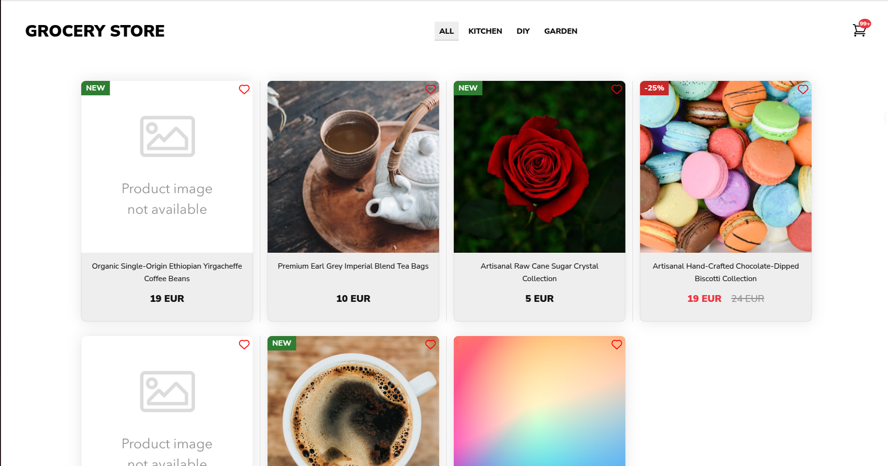

# Antavo frontend assignment (1)



### Frontend
- **Framework**: Nuxt.js 3.15.4
- **UI Library**: Vue 3.5.13
- **State Management**: Pinia 3.0.1

### Styling & Templates
- **Preprocessors**: Sass
- **Template Engine**: Pug

### Utilities
- **Date Handling**: date-fns
- **Utils**: lodash, @vueuse/core
- **Image Processing**: @nuxt/image

### Development
- **Language**: TypeScript
- **Build Tool**: Vite
- **Package Manager**: pnpm

### API Endpoints

- `GET /api/inventory`: Fetch all products
- `POST /api/inventory`: Create new product
- `GET /api/inventory/[id]`: Get single product
- `PATCH /api/inventory/[id]`: Update product with timestamp validation

### Set up the project

#### General Setup

1. Clone the repository
```bash
git clone https://github.com/yourusername/antavo-frontend-assignment.git
```

2. Install dependencies
```bash
pnpm install
```

3. Run the development server
```bash
pnpm run dev
```
The application will be available at http://localhost:3000

#### Docker Setup

1. Build the Docker image
```bash
docker build -t antavo-frontend-assignment .
```

2. Run the Docker container
```bash
docker run -p 3000:3000 antavo-frontend-assignment  
```
The application will be available at http://localhost:3000

### How to application works

The application is a single page application, which is built with Nuxt.js and uses the Composition API. It allows you to add items to the cart either by clicking the "Add to Cart" button. One can change the quantity of the item by clicking the "+" or "-" button, so the selected quantity will be added to the cart instead of just 1. Additionally, when the product has the maximum quantity in the cart, the buttons on the product card and therefore adding more items to the cart, are be disabled. In the cart, one will be able to modify the quantity of a certain item or remove the item from the cart. Upon interacting with the '+', '-' buttons or the input fields in the cart, the frontend will send a request to the server to update the quantity of the item.

The server will respond with the updated item, then the frontend will update the local state. If the quantity of the item is changed, the frontend will also update the local state of the item. If the quantity of the item is changed to a value that is higher than the max quantity, the UI will hightlight the selected item with red background color. The user will be able to see the last updated timestamp of the item, while the server will eventually update the timestamp if the maximum quantity of the item, whenever it is changed. The server is established with mock data, where maxQuantity is randomized every 60 seconds.

### State management

Meanwhile, composables are intended to be general-purpose, I used Pinia for the state management to separate the concerns of the state management from UI logic and it also has a better typescript support and is compatible with the composition API. There are 2 stores in the application:

1. productsStore: keeps tracking the the quantity of products, syncs with the server, and handles conflicts.
2. cartStore: manages the items in the cart, and the quantity of each item, persists data to local storage and handles pending updates.

### Caching strategy

For caching, I used a cache-first approach with 60 seconds time-to-live interval, where the data is cached in the local storage, and the data is fetched from the local storage first, and then the freshly updated data is fetched from the server. If the data is not in the local storage, the data is fetched from the server and then cached in the local storage. These updates are optimistic and they may be rerolled if the server returns a conflicing value.

### Conflict resolution

The system implements an optimistic update strategy with conflict detection and resolution. When a user makes changes to product quantities, the application immediately updates the UI while periodically verifying these changes with the server.

Conflicts can occur in 3 scenarios:

1. When a user tries to add more items to their cart than are available
The user modifies the product quantity and exceeds the maximum quantity, the item will be put into state of conflict and and will be marked on the UI with a red background color and error message.

2. When the server updates product quantities during user interactions 
When a conflict arises, the server will adjust the product quantities automatically and rerolls them upon invalid changes, then updates the UI.

3. When multiple users modify the same product simultaneously
The user is able to set the cart item quantities manually and has the option to remove conflicting items

### Known limitations

While the project quality is influenced by the marked time constraint (8 hours to complete the project), there are a few limitations to consider (some of which are due to easier presentation):

Systematic limitations:
- The intervals between updates are quite short
- There are otential issues with race conditions
- The application may be affected by network latency

UX limitations:
- Some automatic adjustments might be inconvinient for users
- Upon conflict, manual intervention is required
- Visualization is incomplete (especially on mobile view)

Technical limitations:
- Relying on accurate timestamps may cause problems
- The cache validation is very basic

### Further improvements

Architecture:
- Add request queuing for offline support
- Implement WebSocket for real-time updates instead of polling (this would be big step)

State management:
- Adding different types for Product and CartItem
- Improve conflict resolution with three-way merge
- Adding optimistic locking for concurrent modifications

UX:
- Toast notifications for user interactions
- Add a confirmation modal for removing items from the cart

Performance:
- Implementing rate limiter
- Implementing service worker for offline caching
- Creating a more advanced request batching
